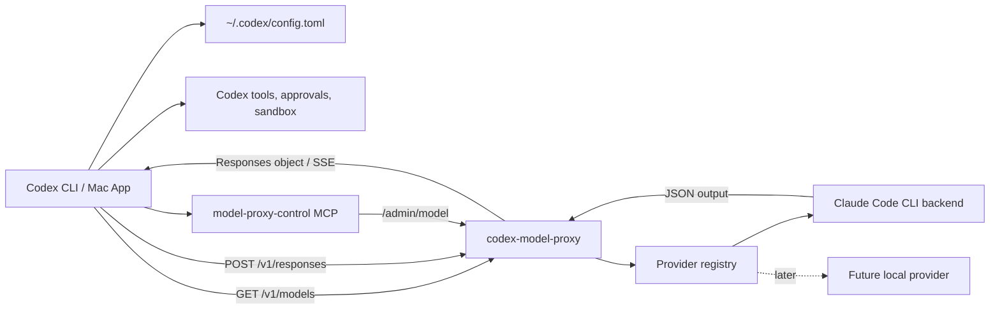

# Codex Model Proxy

Local OpenAI Responses-compatible proxy for using subscription-backed local model runners from Codex.

The first backend is Claude Code through the installed `claude` terminal command. The repo is intentionally structured so other local providers can be added later without rewriting the Codex-facing API, model picker metadata, active-model switcher, or MCP control server.

This project does not use the Claude Agent SDK. It invokes the local terminal command as the current user, parses the command output, and exposes the endpoints Codex expects from a model provider.

## Why This Exists

Codex already knows how to drive an agentic coding workflow: it owns the workspace, runs shell commands, edits files, asks for approvals, respects sandbox settings, and integrates with the Mac app. Claude Code already knows how to talk to Claude models through your local terminal subscription. The missing piece is a clean bridge between those two worlds.

`codex-model-proxy` is that bridge. It lets Codex keep acting like Codex while the model response can come from a local subscription-backed runner.

That matters because a naive Claude integration can accidentally move the tool-running boundary into Claude Code itself. This repo deliberately avoids that. Claude Code's local tools are disabled for proxied requests, and Codex remains the only thing that runs commands, reads files through tools, edits files, asks for approvals, and applies patches.

## Why It Is Useful

- Use Claude Code models from the Codex CLI or Mac app through a local provider.
- Keep Codex's approvals, sandboxing, tool loops, and Mac app behavior intact.
- Switch between configured backend models without restarting Codex.
- Keep the proxy local on `127.0.0.1` with a bearer token.
- Add future local/subscription providers behind the same Codex-facing API.
- Control the proxy from Codex through generic MCP tools such as `list_models` and `switch_model`.

The practical goal is not just "curl returns text." The useful target is: Codex can chat, review code, call tools, and edit files while the model answer comes from a local backend such as Claude Code.

## Mental Model

Codex sees one normal local Responses provider:

```text
model_provider = "claude_code_cli_proxy"
model = "claude"
```

The proxy sees that stable `claude` model and resolves it to the active backend model:

```text
claude -> sonnet
claude -> opus
claude -> fable
claude -> haiku
```

That means Codex can stay configured to one stable model while you switch the real backend model through:

```bash
.venv/bin/codex-model-proxyctl opus
.venv/bin/codex-model-proxyctl sonnet
.venv/bin/codex-model-proxyctl fable
.venv/bin/codex-model-proxyctl haiku
```

or through the MCP tool:

```text
switch model to opus
```

## Quick Start

From a fresh checkout:

```bash
cd ~/Documents/GitHub/codex-model-proxy
python3 -m venv .venv
. .venv/bin/activate
pip install -e ".[dev]"
```

Start the proxy:

```bash
PROXY_API_KEY=local-dev-key .venv/bin/codex-model-proxy
```

Check it:

```bash
curl -s http://127.0.0.1:8000/health
curl -s 'http://127.0.0.1:8000/v1/models?client_version=0.143.0' \
  -H 'Authorization: Bearer local-dev-key'
```

Configure Codex in `~/.codex/config.toml`:

```toml
model = "claude"
model_provider = "claude_code_cli_proxy"

[model_providers.claude_code_cli_proxy]
name = "Codex Model Proxy"
base_url = "http://127.0.0.1:8000/v1"
wire_api = "responses"
stream_idle_timeout_ms = 600000
stream_max_retries = 1

[model_providers.claude_code_cli_proxy.auth]
command = "/absolute/path/to/.codex/claude-cli-proxy-token.sh"
timeout_ms = 5000
refresh_interval_ms = 0
```

Token helper:

```bash
#!/usr/bin/env bash
printf '%s\n' 'local-dev-key'
```

`local-dev-key` is only a placeholder for local loopback development. Replace it with your own random value if you want a less guessable local token, and do not expose the proxy outside `127.0.0.1`.

Then restart the Codex Mac app or start a new Codex CLI session.

## Day-To-Day Use

Keep the proxy running on port `8000`, and keep Codex configured to:

```toml
model = "claude"
model_provider = "claude_code_cli_proxy"
```

List backend models:

```bash
cd ~/Documents/GitHub/codex-model-proxy
PROXY_API_KEY=local-dev-key .venv/bin/codex-model-proxyctl --list
```

Switch backend models:

```bash
PROXY_API_KEY=local-dev-key .venv/bin/codex-model-proxyctl opus
PROXY_API_KEY=local-dev-key .venv/bin/codex-model-proxyctl sonnet
```

Use Codex normally. The next Codex request using `model = "claude"` will resolve to the newly active backend model.

If the MCP control server is configured, you can also ask Codex:

```text
list proxy models
switch model to opus
show model proxy status
start the model proxy
```

With `MODEL_PROXY_AUTOSTART=1`, the MCP server will also start the HTTP proxy automatically when Codex starts the MCP server. That makes the normal desktop flow:

```text
Open Codex -> MCP starts -> proxy starts on 127.0.0.1:8000 -> use model = "claude"
```

## Current Status

Ready for local testing.

Verified locally:

- Unit tests pass.
- `GET /health` works.
- `GET /v1/models?client_version=0.143.0` returns OpenAI and Codex model catalog shapes.
- `POST /v1/responses` works through the local Claude Code CLI backend.
- The optional MCP server exposes generic proxy-control tools.

## What This Enables

Codex can be configured with a local provider named `claude_code_cli_proxy`.

With that provider active:

- Codex asks this proxy for model metadata via `/v1/models`.
- Codex sends OpenAI Responses API requests to `/v1/responses`.
- The proxy forwards the normalized request to the active local backend model.
- The backend response is converted back into a Codex-compatible Responses object.
- Codex remains the tool runner for shell commands, file edits, approvals, sandboxing, and Mac app behavior.
- A generic MCP server can list backend models, switch the active backend model, show status, and start the proxy.

The stable Codex-facing model is currently `claude`. The proxy resolves that stable model to whichever backend model is active, such as `fable`, `opus`, `sonnet`, `haiku`, `claude-fable-5`, `claude-opus-4-8`, `claude-sonnet-5`, or `claude-haiku-4-5`.

The short names are Claude Code latest-model aliases. Claude Code itself resolves `fable`, `opus`, `sonnet`, and `haiku` to the latest available model in that family. The concrete IDs are included for cases where you want an explicit fixed model instead of an alias.

## Architecture



## Provider Structure

The generic layers are:

- `codex_model_proxy.server`: FastAPI app, auth, `/health`, `/admin/model`, `/v1/models`, `/v1/responses`.
- `codex_model_proxy.responses`: Responses bridge, transcript store, streaming event shape, tool-call adapter.
- `codex_model_proxy.active_model`: provider-aware active backend model store.
- `codex_model_proxy.model_cli`: generic terminal switcher, installed as `codex-model-proxyctl`.
- `codex_model_proxy.mcp_server`: generic stdio MCP control server.
- `codex_model_proxy.providers.base`: provider dataclasses.
- `codex_model_proxy.providers.registry`: selected provider lookup.
- `codex_model_proxy.providers.claude_code`: Claude Code provider spec.
- `codex_model_proxy.claude_cli`: Claude Code CLI backend runner.

To add another provider later:

1. Add a provider spec/factory under `src/codex_model_proxy/providers/`.
2. Register it in `ProviderRegistry`.
3. Add a model runner client with a `complete(prompt, model, ...)` method.
4. Wire the runner in `make_model_client()` in `server.py`.
5. Add tests for model resolution, catalog output, and a mocked completion.

The API and MCP layers should not need provider-specific logic except the runner factory.

## Important Boundary

This proxy does not certify subscription, licensing, or terms questions. It only invokes local model commands as the current user.

For Claude Code, terminal tools are disabled for proxy calls with `--tools ""`. That is deliberate: Codex should run shell commands, file edits, approvals, and sandboxed workflows. The backend supplies the model response; Codex performs the actions.

## Requirements

- Python 3.10 or newer.
- For the current backend: Claude Code CLI installed as `claude`.
- Claude CLI already authenticated locally.
- Codex configured to use a local Responses provider.

Check Claude auth:

```bash
claude auth login
claude --print "auth test"
```

Check the installed Claude command:

```bash
which claude
claude --version
```

## Install

```bash
cd ~/Documents/GitHub/codex-model-proxy
python3 -m venv .venv
. .venv/bin/activate
pip install -e ".[dev]"
```

## Run

Default server command:

```bash
cd ~/Documents/GitHub/codex-model-proxy
PROXY_API_KEY=local-dev-key .venv/bin/codex-model-proxy
```

Equivalent Uvicorn command:

```bash
cd ~/Documents/GitHub/codex-model-proxy
PROXY_API_KEY=local-dev-key .venv/bin/uvicorn codex_model_proxy.server:app --host 127.0.0.1 --port 8000
```

The server listens on:

```text
http://127.0.0.1:8000
```

The old command names still exist as aliases:

```bash
.venv/bin/codex-claude-code-proxy
.venv/bin/codex-claude-model
```

## Environment Variables

| Variable | Default | Purpose |
| --- | --- | --- |
| `PROXY_API_KEY` | `local-dev-key` | Bearer token expected by `/v1/*` and `/admin/*`. Set empty to disable auth. |
| `HOST` | `127.0.0.1` | Host used by `codex-model-proxy`. |
| `PORT` | `8000` | Port used by `codex-model-proxy`. |
| `MODEL_PROXY_BACKEND` | `claude_code` | Selected backend provider ID. |
| `MODEL_PROXY_PROVIDER_ID` | `claude_code_cli_proxy` | Codex provider label returned by control tools. |
| `MODEL_PROXY_DISPLAY_NAME` | `Claude` | Display name for the stable Codex-facing model. |
| `MODEL_PROXY_STABLE_MODEL` | `claude` | Stable Codex-facing model slug. |
| `MODEL_PROXY_DEFAULT_MODEL` | `opus` | Backend model used when no active model file is present. This uses Claude Code's latest Opus alias. |
| `MODEL_PROXY_ACTIVE_MODEL_FILE` | `~/.codex/model-proxy-active-model` | Generic active backend model file. |
| `MODEL_PROXY_MODELS` | `fable,opus,sonnet,haiku,claude-fable-5,claude-opus-4-8,claude-sonnet-5,claude-haiku-4-5,claude-haiku-4-5-20251001` | Backend models advertised by the current provider. Aliases are listed first. |
| `CLAUDE_COMMAND` | `claude` | Claude Code CLI command to execute for the current backend. |
| `CLAUDE_TIMEOUT_SECONDS` | `300` | Subprocess timeout for each Claude request. |
| `CLAUDE_SAFE_MODE` | `1` | Adds `--safe-mode` to Claude CLI invocations. |
| `CLAUDE_PERMISSION_MODE` | `dontAsk` | Permission mode passed to Claude CLI. |
| `CLAUDE_CWD` | server process cwd | Working directory for Claude CLI subprocesses. |
| `CLAUDE_DEFAULT_MODEL` | `opus` | Backward-compatible default model override for the Claude backend. |
| `CLAUDE_ACTIVE_MODEL_FILE` | unset | Backward-compatible active-model file override for the Claude backend. |
| `CLAUDE_MODELS` | unset | Backward-compatible model list override for the Claude backend. |
| `RESPONSE_TTL_SECONDS` | `3600` | In-memory response/session retention. |
| `MODEL_PROXY_BASE_URL` | `http://127.0.0.1:8000` | Proxy base URL used by the CLI/MCP control tools. |
| `MODEL_PROXY_API_KEY` | `local-dev-key` | Bearer token used by the CLI/MCP control tools. |
| `MODEL_PROXY_CWD` | current directory | Directory used when MCP starts the proxy process. |
| `MODEL_PROXY_AUTOSTART` | unset | Set to `1` to make the MCP server start the HTTP proxy automatically on MCP startup. |
| `MODEL_PROXY_LOG_FILE` | `~/.codex/model-proxy-control.log` | Log file used when MCP starts the proxy process. |
| `MODEL_PROXY_PID_FILE` | `~/.codex/model-proxy.pid` | PID file used when MCP starts the proxy process. |

## HTTP Smoke Tests

Health:

```bash
curl -s http://127.0.0.1:8000/health
```

Models:

```bash
curl -s 'http://127.0.0.1:8000/v1/models?client_version=0.143.0' \
  -H 'Authorization: Bearer local-dev-key'
```

Non-streaming response:

```bash
curl -s http://127.0.0.1:8000/v1/responses \
  -H 'Authorization: Bearer local-dev-key' \
  -H 'Content-Type: application/json' \
  -d '{"model":"claude","input":"Reply with exactly: proxy-ok"}'
```

Compatibility streaming:

```bash
curl -N http://127.0.0.1:8000/v1/responses \
  -H 'Authorization: Bearer local-dev-key' \
  -H 'Content-Type: application/json' \
  -d '{"model":"claude","input":"Reply with exactly: stream-ok","stream":true}'
```

Streaming waits for the backend command to finish, then emits valid SSE events with monotonic `sequence_number`.

## Codex Configuration

Add the provider to user-level config:

```text
~/.codex/config.toml
```

Provider block:

```toml
[model_providers.claude_code_cli_proxy]
name = "Codex Model Proxy"
base_url = "http://127.0.0.1:8000/v1"
wire_api = "responses"
stream_idle_timeout_ms = 600000
stream_max_retries = 1

[model_providers.claude_code_cli_proxy.auth]
command = "/absolute/path/to/.codex/claude-cli-proxy-token.sh"
timeout_ms = 5000
refresh_interval_ms = 0
```

Token helper:

```bash
#!/usr/bin/env bash
printf '%s\n' 'local-dev-key'
```

Make it executable:

```bash
chmod 700 ~/.codex/claude-cli-proxy-token.sh
```

For the Codex Mac app, set the user-level default provider/model:

```toml
model = "claude"
model_provider = "claude_code_cli_proxy"
```

Then restart the Codex Mac app so it reloads config and model metadata.

One-off CLI validation:

```bash
codex -c model_provider='"claude_code_cli_proxy"' \
  -c model='"claude"' \
  exec "Reply with exactly: codex-ok"
```

Default-provider validation:

```bash
codex exec "Reply with exactly: default-codex-ok"
```

## Switching Backend Models

Keep Codex pointed at the stable model:

```toml
model = "claude"
model_provider = "claude_code_cli_proxy"
```

Switch the active backend model while Codex and the proxy remain open:

```bash
cd ~/Documents/GitHub/codex-model-proxy
PROXY_API_KEY=local-dev-key .venv/bin/codex-model-proxyctl sonnet
PROXY_API_KEY=local-dev-key .venv/bin/codex-model-proxyctl opus
PROXY_API_KEY=local-dev-key .venv/bin/codex-model-proxyctl fable
PROXY_API_KEY=local-dev-key .venv/bin/codex-model-proxyctl haiku
PROXY_API_KEY=local-dev-key .venv/bin/codex-model-proxyctl claude-opus-4-8
```

Show current and available backend models:

```bash
PROXY_API_KEY=local-dev-key .venv/bin/codex-model-proxyctl --list
```

The same switch is available over HTTP:

```bash
curl -s http://127.0.0.1:8000/admin/model \
  -H 'Authorization: Bearer local-dev-key'

curl -s http://127.0.0.1:8000/admin/model \
  -H 'Authorization: Bearer local-dev-key' \
  -H 'Content-Type: application/json' \
  -d '{"model":"opus"}'
```

## Optional MCP Control Server

The repo ships a local stdio MCP server. It does not replace the Responses proxy; it gives Codex tools for controlling the local proxy while Codex is running.

Codex config is needed here for the same reason it is needed for any local stdio MCP server: Codex has to know which executable to launch, which working directory to use, what startup/tool timeouts to apply, and which environment variables to pass into the MCP process. The MCP server is not discovered automatically from the repo.

This repo uses two separate config blocks because there are two separate integrations:

- `[model_providers.claude_code_cli_proxy]` tells Codex where to send model requests.
- `[mcp_servers.model_proxy_control]` tells Codex how to launch the local MCP control server.

With `MODEL_PROXY_AUTOSTART = "1"`, the MCP server also starts the HTTP proxy process after Codex launches the MCP server. So the config is what lets Codex start the controller, and the controller is what starts or manages the proxy.

Tools:

- `model_proxy_status`
- `list_models`
- `switch_model`
- `start_model_proxy`

Add this user-level block to `~/.codex/config.toml`:

```toml
[mcp_servers.model_proxy_control]
command = "/absolute/path/to/codex-model-proxy/.venv/bin/codex-model-proxy-mcp"
cwd = "/absolute/path/to/codex-model-proxy"
startup_timeout_sec = 10
tool_timeout_sec = 30
default_tools_approval_mode = "prompt"

[mcp_servers.model_proxy_control.env]
MODEL_PROXY_PROVIDER_ID = "claude_code_cli_proxy"
MODEL_PROXY_BASE_URL = "http://127.0.0.1:8000"
MODEL_PROXY_API_KEY = "local-dev-key"
MODEL_PROXY_CWD = "/absolute/path/to/codex-model-proxy"
MODEL_PROXY_AUTOSTART = "1"

[mcp_servers.model_proxy_control.tools.model_proxy_status]
approval_mode = "approve"

[mcp_servers.model_proxy_control.tools.list_models]
approval_mode = "approve"

[mcp_servers.model_proxy_control.tools.switch_model]
approval_mode = "approve"

[mcp_servers.model_proxy_control.tools.start_model_proxy]
approval_mode = "prompt"
```

With `MODEL_PROXY_AUTOSTART = "1"`, restarting Codex should start the MCP server, and the MCP server should start the HTTP proxy if it is not already running.

Examples you can ask:

```text
list proxy models
switch model to opus
show model proxy status
start the model proxy
```

If the Codex app tries to send a model request before MCP autostart finishes, the first request can still race the proxy startup. If that happens, wait a moment and send again. For the strongest always-on behavior, use a macOS LaunchAgent to start the proxy at login, then use MCP for status and switching.

## Claude Code Backend Details

For each Responses request, the Claude backend runs:

```bash
claude \
  --print \
  --output-format json \
  --safe-mode \
  --tools "" \
  --permission-mode dontAsk \
  --model "<resolved-backend-model>"
```

The prompt is sent through stdin. The proxy expects Claude to return JSON events and uses the final `result` event or assistant text content as the answer.

`--tools ""` keeps Claude Code's own filesystem and shell tools disabled so Codex remains the only tool runner.

## How Responses Bridging Works

1. Codex sends a Responses request to `/v1/responses`.
2. The proxy resolves the requested model through the selected provider.
3. The proxy normalizes `instructions`, string input, message-list input, and `function_call_output` items.
4. If `previous_response_id` is present, the proxy loads the previous transcript from memory.
5. If Codex includes `tools`, the proxy describes those tools to the backend using a strict XML protocol.
6. The selected backend model runner receives the complete prompt.
7. If the backend returns normal text, the proxy returns a Responses `message` output item.
8. If the backend requests a tool using the XML protocol, the proxy returns a Responses `function_call` item.
9. Codex executes the tool itself and sends the result back as `function_call_output`.
10. The proxy includes that tool result in the next backend prompt and the loop continues.

Tool request protocol shown to the backend:

```xml
<codex_function_call>{"name":"tool_name","arguments":{}}</codex_function_call>
```

The proxy asks for exactly one tool call at a time. This keeps the first version simple and compatible with Codex's tool loop.

## Testing

Run unit tests:

```bash
cd ~/Documents/GitHub/codex-model-proxy
.venv/bin/pytest -q
```

Manual app test:

1. Start the proxy on `127.0.0.1:8000`.
2. Confirm `~/.codex/config.toml` points Codex at `model_provider = "claude_code_cli_proxy"` and `model = "claude"`.
3. Restart the Codex Mac app.
4. Ask: `Reply with exactly: mac-app-ok`.
5. Test a tool loop in a throwaway repo: `Inspect the current directory and summarize the files.`

The key validation is that Codex asks for and runs tools itself, rather than Claude Code running local tools directly.

## Known Limitations

- The Claude model list is configured by `MODEL_PROXY_MODELS` or `CLAUDE_MODELS`, not dynamically discovered from Claude CLI.
- The proxy process must be running before Codex can fetch proxy model metadata.
- Session continuity is in memory only. Restarting the proxy clears `previous_response_id` history.
- Streaming is compatibility streaming, not true token-by-token streaming from the backend.
- The tool-call adapter supports one function call at a time.
- Claude CLI behavior may change across versions, so `claude --print --output-format json` should be included in smoke testing after upgrades.
- This is local development software, not a hosted multi-user service.

## Troubleshooting

### `401 Missing or invalid bearer token`

Check that the request uses:

```text
Authorization: Bearer local-dev-key
```

For Codex, check the token helper:

```bash
~/.codex/claude-cli-proxy-token.sh
```

### `Claude CLI command not found`

Check:

```bash
which claude
```

If needed, set:

```bash
export CLAUDE_COMMAND=/absolute/path/to/claude
```

### `Claude CLI timed out`

Increase:

```bash
export CLAUDE_TIMEOUT_SECONDS=600
```

### Codex model picker does not show proxy models

Check:

```bash
curl -s 'http://127.0.0.1:8000/v1/models?client_version=0.143.0' \
  -H 'Authorization: Bearer local-dev-key'
```

Confirm the response includes a `models` array with the stable slug:

```json
{
  "models": [
    {
      "slug": "claude"
    }
  ]
}
```

Restart the Codex Mac app after changing `~/.codex/config.toml`.

### Codex logs unrelated MCP warnings

Warnings about unrelated MCP servers, OAuth refresh, or plugin manifests can appear before or after a successful request. During validation, these did not prevent the proxy from returning responses through Codex.

### Claude returns JSON with `rate_limit_event`

That is expected with recent Claude CLI versions. This proxy parses the raw CLI JSON itself and ignores that event type when building the final Responses output.

## Development Notes

The server should stay bound to `127.0.0.1` for local testing.

Package rename notes:

- New project and repo name: `codex-model-proxy`.
- New Python package: `codex_model_proxy`.
- Compatibility package: `codex_claude_code_proxy`.
- New server command: `codex-model-proxy`.
- New switcher command: `codex-model-proxyctl`.
- Compatibility commands: `codex-claude-code-proxy`, `codex-claude-model`.

## Git State

This repository has been initialized with `git init`, but the initial files have not been committed yet.
