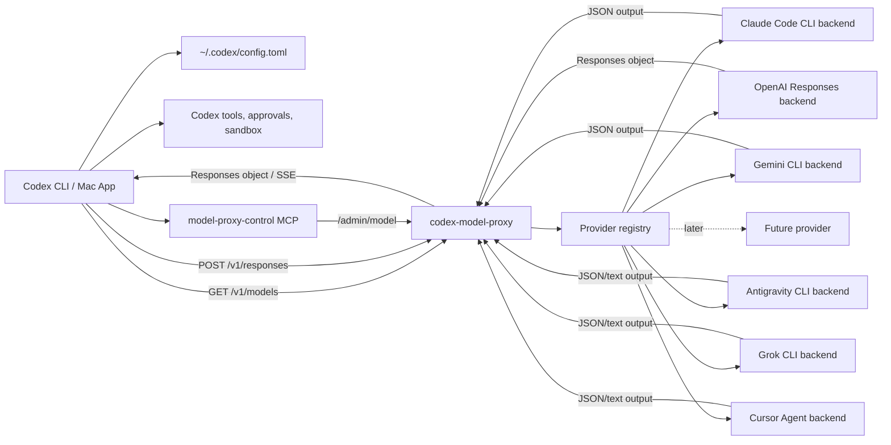

# Codex Model Proxy

Local model router for Codex. It lets the Codex CLI or Mac app talk to one local OpenAI Responses-compatible endpoint, while the actual model can come from Claude Code, OpenAI, Gemini, Antigravity, Grok, Cursor, or another provider you add later.

The easiest way to use it is with the included MCP control server. Codex starts the MCP server, the MCP server starts the local HTTP proxy, and then you can switch models by chatting:

```text
list proxy models
switch model to opus
switch model to gpt
switch provider to grok
show model proxy status
```

Codex still owns the coding workflow. It runs shell commands, edits files, asks for approvals, applies patches, and respects sandboxing. The backend model supplies responses; Codex remains the tool runner.

## Supported Providers

| Provider | Default route | Useful aliases | How it connects | Setup needed |
| --- | --- | --- | --- | --- |
| Claude Code | `claude:opus` | `opus`, `sonnet`, `haiku`, `fable` | Local `claude` CLI | `claude auth login` |
| OpenAI | `openai:gpt-5.5` | `gpt`, `openai`, `chatgpt`, `mini`, `spark` | OpenAI Responses API | `OPENAI_API_KEY` in the proxy environment |
| Gemini CLI | `gemini:gemini-3-pro` | `gemini`, `gemini-pro`, `flash` | Local `gemini` CLI | Gemini CLI auth or API/Vertex credentials |
| Antigravity | `antigravity:gemini-3.5-flash-medium` | `antigravity`, `antigravity-pro`, `antigravity-flash` | Local `agy` CLI | Antigravity subscription login |
| Grok | `grok:grok-4.5` | `grok`, `xai`, `grok-latest` | Local `grok` CLI | `grok login` plus credits/subscription |
| Cursor | `cursor:auto` | `cursor`, `composer`, `cursor-opus`, `cursor-gpt`, `cursor-gemini` | Local `cursor-agent` CLI | `cursor-agent login` or `CURSOR_API_KEY` |

The provider list is config-driven. Built-in catalogs cover the model lists we can verify locally, and you can override them with environment variables such as `CLAUDE_MODELS`, `GROK_MODELS`, or `CURSOR_MODELS`.

## Model Catalog Coverage

| Provider | Built-in catalog source |
| --- | --- |
| Claude Code | Aliases and full model-name behavior documented by `claude --help`; defaults include `fable`, `opus`, `sonnet`, `haiku`, and their latest full names. |
| OpenAI | Static Responses API defaults because available API models depend on the key/account; override with `OPENAI_MODELS` for your account. |
| Gemini CLI | Static Gemini CLI defaults because this CLI exposes `--model` but not a local model catalog command in the tested install. |
| Antigravity | Mirrors the local `agy models` output. |
| Grok | Mirrors the local `grok models` output. |
| Cursor | Mirrors the local `cursor-agent models` output, including Codex, GPT, Claude, Grok, Gemini, Composer, Kimi, and GLM entries. |

## How It Works

Codex is configured once with a stable local model:

```toml
model = "claude"
model_provider = "claude_code_cli_proxy"
```

The proxy maps that stable Codex-facing model to the active backend route:

```text
claude -> claude:opus
claude -> openai:gpt-5.5
claude -> antigravity:gemini-3.5-flash-medium
claude -> grok:grok-4.5
claude -> cursor:auto
```

When you switch models through MCP, Codex does not need to restart and its configured provider does not change. The next request to `model = "claude"` uses the newly active backend.

## Recommended Setup: MCP Autostart

This is the cleanest desktop workflow:

```text
Open Codex -> Codex starts MCP -> MCP starts proxy on 127.0.0.1:8000 -> ask Codex to switch/list models
```

### 1. Install

```bash
cd ~/Documents/GitHub/codex-model-proxy
python3 -m venv .venv
. .venv/bin/activate
pip install -e ".[dev]"
```

### 2. Authenticate the backends you want

You only need to authenticate the providers you plan to use:

```bash
claude auth login
grok login
cursor-agent login
gemini
agy
```

For OpenAI routes, put an API key in the environment used to start the proxy:

```bash
export OPENAI_API_KEY="sk-..."
```

### 3. Create a local token helper

The proxy is local-only by default, but Codex still sends a bearer token. Create:

```text
~/.codex/claude-cli-proxy-token.sh
```

with:

```bash
#!/usr/bin/env bash
printf '%s\n' 'local-dev-key'
```

Then:

```bash
chmod 700 ~/.codex/claude-cli-proxy-token.sh
```

`local-dev-key` is a development placeholder. Use your own random token if you want a less guessable local key.

### 4. Configure Codex

Add both blocks to user-level config:

```text
~/.codex/config.toml
```

Replace `/absolute/path/to/codex-model-proxy` with your checkout path, for example `/Users/you/Documents/GitHub/codex-model-proxy`.

```toml
model = "claude"
model_provider = "claude_code_cli_proxy"

[model_providers.claude_code_cli_proxy]
name = "Codex Model Proxy"
base_url = "http://127.0.0.1:8000/v1"
wire_api = "responses"
stream_idle_timeout_ms = 600000
stream_max_retries = 1

[model_providers.claude_code_cli_proxy.auth]
command = "/absolute/path/to/.codex/claude-cli-proxy-token.sh"
timeout_ms = 5000
refresh_interval_ms = 0

[mcp_servers.model_proxy_control]
command = "/absolute/path/to/codex-model-proxy/.venv/bin/codex-model-proxy-mcp"
cwd = "/absolute/path/to/codex-model-proxy"
startup_timeout_sec = 10
tool_timeout_sec = 30
default_tools_approval_mode = "prompt"

[mcp_servers.model_proxy_control.env]
MODEL_PROXY_PROVIDER_ID = "claude_code_cli_proxy"
MODEL_PROXY_BASE_URL = "http://127.0.0.1:8000"
MODEL_PROXY_API_KEY = "local-dev-key"
MODEL_PROXY_CWD = "/absolute/path/to/codex-model-proxy"
MODEL_PROXY_AUTOSTART = "1"

[mcp_servers.model_proxy_control.tools.model_proxy_status]
approval_mode = "approve"

[mcp_servers.model_proxy_control.tools.list_models]
approval_mode = "approve"

[mcp_servers.model_proxy_control.tools.switch_model]
approval_mode = "approve"

[mcp_servers.model_proxy_control.tools.switch_provider]
approval_mode = "approve"

[mcp_servers.model_proxy_control.tools.start_model_proxy]
approval_mode = "prompt"
```

### 5. Restart Codex and test

After restarting the Codex Mac app or starting a new Codex CLI session, ask:

```text
show model proxy status
list proxy models
switch provider to grok
switch model to opus
```

The MCP server should start the proxy automatically. You can also check the HTTP service directly:

```bash
curl -s http://127.0.0.1:8000/health
curl -s 'http://127.0.0.1:8000/v1/models?client_version=0.143.0' \
  -H 'Authorization: Bearer local-dev-key'
```

## Day-To-Day Use

Use normal language inside Codex:

```text
list proxy models
switch model to opus
switch model to gpt
switch provider to gemini
switch provider to grok
switch provider to cursor
show model proxy status
```

You can also switch from a terminal:

```bash
cd ~/Documents/GitHub/codex-model-proxy
PROXY_API_KEY=local-dev-key .venv/bin/codex-model-proxyctl --list
PROXY_API_KEY=local-dev-key .venv/bin/codex-model-proxyctl opus
PROXY_API_KEY=local-dev-key .venv/bin/codex-model-proxyctl grok
PROXY_API_KEY=local-dev-key .venv/bin/codex-model-proxyctl cursor
```

## Manual Server Start

MCP autostart is recommended. If you want to run the proxy manually instead:

```bash
cd ~/Documents/GitHub/codex-model-proxy
PROXY_API_KEY=local-dev-key .venv/bin/codex-model-proxy
```

## Architecture



## Provider Structure

The generic layers are:

- `codex_model_proxy.server`: FastAPI app, auth, `/health`, `/admin/model`, `/v1/models`, `/v1/responses`.
- `codex_model_proxy.responses`: Responses bridge, transcript store, streaming event shape, tool-call adapter.
- `codex_model_proxy.active_model`: active backend route store.
- `codex_model_proxy.model_cli`: generic terminal switcher, installed as `codex-model-proxyctl`.
- `codex_model_proxy.mcp_server`: generic stdio MCP control server.
- `codex_model_proxy.providers.base`: provider dataclasses.
- `codex_model_proxy.providers.registry`: provider catalog, route aliases, and model resolution.
- `codex_model_proxy.providers.claude_code`: Claude Code provider spec.
- `codex_model_proxy.providers.openai_responses`: OpenAI provider spec.
- `codex_model_proxy.providers.gemini_cli`: Gemini CLI provider spec.
- `codex_model_proxy.providers.antigravity_cli`: Antigravity CLI provider spec.
- `codex_model_proxy.providers.grok_cli`: Grok CLI provider spec.
- `codex_model_proxy.providers.cursor_agent`: Cursor Agent CLI provider spec.
- `codex_model_proxy.claude_cli`: Claude Code CLI backend runner.
- `codex_model_proxy.openai_responses`: OpenAI Responses backend runner.
- `codex_model_proxy.gemini_cli`: Gemini CLI backend runner.
- `codex_model_proxy.antigravity_cli`: Antigravity CLI backend runner.
- `codex_model_proxy.grok_cli`: Grok CLI backend runner.
- `codex_model_proxy.cursor_agent`: Cursor Agent CLI backend runner.
- `codex_model_proxy.headless_cli`: reusable adapter for JSON/text headless CLIs.
- `codex_model_proxy.model_clients`: route dispatcher from provider-qualified IDs to backend runners.

To add another provider later:

1. Add a provider spec/factory under `src/codex_model_proxy/providers/`.
2. Register it in `ProviderRegistry`.
3. Add a model runner client with a `complete(prompt, model, ...)` method.
4. Wire the runner in `RoutedModelClient`.
5. Add tests for model resolution, catalog output, and a mocked completion.

The API and MCP layers should not need provider-specific logic except the runner factory.

## Important Boundary

This proxy does not certify subscription, licensing, or terms questions. It only invokes configured local model commands as the current user or calls configured provider APIs with credentials you provide.

For Claude Code, terminal tools are disabled for proxy calls with `--tools ""`. Gemini CLI is run in non-interactive default approval mode, which excludes tools that require prompts such as shell/edit/write/web-fetch in the installed Gemini CLI tested here. Grok, Cursor, and Antigravity are invoked without force/auto-approve flags by default. The prompt also tells every backend to ask Codex for tools through the proxy XML protocol. That is deliberate: Codex should run shell commands, file edits, approvals, and sandboxed workflows. The backend supplies the model response; Codex performs the actions.

## Requirements

- Python 3.10 or newer.
- For Claude routes: Claude Code CLI installed as `claude` and authenticated locally.
- For OpenAI routes: `OPENAI_API_KEY` set in the proxy process environment.
- For Gemini routes: Gemini CLI installed as `gemini` and authenticated locally, or configured with Gemini/Vertex credentials.
- For Antigravity routes: Antigravity CLI installed as `agy` and authenticated locally with the subscription-backed login you want to use.
- For Grok routes: Grok CLI installed as `grok`, authenticated locally, and backed by credits or a subscription.
- For Cursor routes: Cursor Agent CLI installed as `cursor-agent` and authenticated locally, or `CURSOR_API_KEY` set where supported.
- Codex configured to use a local Responses provider.

Check Claude auth:

```bash
claude auth login
claude --print "auth test"
```

Check the installed Claude command:

```bash
which claude
claude --version
```

Check OpenAI auth:

```bash
export OPENAI_API_KEY="sk-..."
curl -s https://api.openai.com/v1/models \
  -H "Authorization: Bearer $OPENAI_API_KEY"
```

Check Gemini auth:

```bash
gemini
gemini -p "auth test" --output-format json
```

Check Antigravity auth:

```bash
agy
agy --print "auth test" --model gemini-3.5-flash-medium --print-timeout 30s
```

If your Antigravity CLI uses different flags, keep the provider and override the invocation:

```bash
export ANTIGRAVITY_ARGS_TEMPLATE="--print {prompt} --model {model} --print-timeout 5m"
```

Check Grok auth:

```bash
grok login
grok models
grok --single "auth test" --output-format json --model grok-4.5
```

Check Cursor auth:

```bash
cursor-agent login
cursor-agent status
cursor-agent --print --output-format json --trust --model auto "auth test"
```

## Install

```bash
cd ~/Documents/GitHub/codex-model-proxy
python3 -m venv .venv
. .venv/bin/activate
pip install -e ".[dev]"
```

## Run

Default server command:

```bash
cd ~/Documents/GitHub/codex-model-proxy
PROXY_API_KEY=local-dev-key .venv/bin/codex-model-proxy
```

Equivalent Uvicorn command:

```bash
cd ~/Documents/GitHub/codex-model-proxy
PROXY_API_KEY=local-dev-key .venv/bin/uvicorn codex_model_proxy.server:app --host 127.0.0.1 --port 8000
```

The server listens on:

```text
http://127.0.0.1:8000
```

## Environment Variables

| Variable | Default | Purpose |
| --- | --- | --- |
| `PROXY_API_KEY` | `local-dev-key` | Bearer token expected by `/v1/*` and `/admin/*`. Set empty to disable auth. |
| `HOST` | `127.0.0.1` | Host used by `codex-model-proxy`. |
| `PORT` | `8000` | Port used by `codex-model-proxy`. |
| `MODEL_PROXY_BACKEND` | `claude_code` | Default provider used when no active model file exists. Available providers: `claude_code`, `openai_responses`, `gemini_cli`, `antigravity_cli`, `grok_cli`, `cursor_agent`. |
| `MODEL_PROXY_ENABLED_PROVIDERS` | unset | Optional comma-separated allow list of provider IDs. When unset, all built-in providers are enabled. |
| `MODEL_PROXY_PROVIDER_ID` | `claude_code_cli_proxy` | Codex provider label returned by control tools. |
| `MODEL_PROXY_DISPLAY_NAME` | `Model Proxy` | Display name for the stable Codex-facing model. |
| `MODEL_PROXY_STABLE_MODEL` | `claude` | Stable Codex-facing model slug. |
| `MODEL_PROXY_DEFAULT_MODEL` | unset | Optional default route or alias used when no active model file is present. Examples: `opus`, `openai:gpt-5.5`, `gemini`, `antigravity`, `grok`, `cursor`. |
| `MODEL_PROXY_ACTIVE_MODEL_FILE` | `~/.codex/model-proxy-active-model` | Generic active backend model file. |
| `CLAUDE_MODELS` | `fable,opus,sonnet,haiku,claude-fable-5,claude-opus-4-8,claude-sonnet-5,claude-haiku-4-5,claude-haiku-4-5-20251001` | Claude backend models. Leave unset unless your Claude CLI exposes a different catalog. |
| `OPENAI_MODELS` | `gpt-5.5,gpt-5.4-mini,gpt-5.3-codex-spark` | OpenAI backend models. Available API models are account-dependent, so override this for your key when needed. |
| `GEMINI_MODELS` | `gemini-3-pro,gemini-2.5-pro,gemini-2.5-flash` | Gemini backend models. Override this if your Gemini CLI account supports a different set. |
| `ANTIGRAVITY_MODELS` | `gemini-3.5-flash-medium,gemini-3.5-flash-high,gemini-3.5-flash-low,gemini-3.1-pro-high,gemini-3.1-pro-low,claude-sonnet-4.6-thinking,claude-opus-4.6-thinking,gpt-oss-120b-medium` | Antigravity backend models. Override if your Antigravity account exposes different slugs. |
| `GROK_MODELS` | `grok-4.5` | Grok backend models. |
| `CURSOR_MODELS` | full built-in `cursor-agent models` catalog | Cursor backend models. Override this only if your Cursor account exposes a different catalog. |
| `CLAUDE_COMMAND` | `claude` | Claude Code CLI command to execute for the current backend. |
| `CLAUDE_TIMEOUT_SECONDS` | `300` | Subprocess timeout for each Claude request. |
| `CLAUDE_SAFE_MODE` | `1` | Adds `--safe-mode` to Claude CLI invocations. |
| `CLAUDE_PERMISSION_MODE` | `dontAsk` | Permission mode passed to Claude CLI. |
| `CLAUDE_CWD` | server process cwd | Working directory for Claude CLI subprocesses. |
| `CLAUDE_DEFAULT_MODEL` | `opus` | Backward-compatible default model override for the Claude backend. |
| `OPENAI_API_KEY` | unset | API key used by OpenAI backend routes. |
| `MODEL_PROXY_OPENAI_API_KEY` | unset | Alternate API key env var for OpenAI backend routes. |
| `OPENAI_BASE_URL` | `https://api.openai.com/v1` | Upstream OpenAI-compatible Responses API base URL. |
| `OPENAI_TIMEOUT_SECONDS` | `300` | Request timeout for OpenAI backend routes. |
| `GEMINI_COMMAND` | `gemini` | Gemini CLI command to execute for Gemini backend routes. |
| `GEMINI_TIMEOUT_SECONDS` | `300` | Subprocess timeout for each Gemini request. |
| `GEMINI_CWD` | server process cwd | Working directory for Gemini CLI subprocesses. |
| `GEMINI_APPROVAL_MODE` | `default` | Approval mode passed to Gemini CLI. Keep `default` unless you intentionally want Gemini CLI tools enabled. |
| `GEMINI_EXTENSIONS` | `none` | Extensions passed to Gemini CLI. Defaults to `none` to keep the backend quiet and Codex-centered. |
| `ANTIGRAVITY_COMMAND` | `agy` | Antigravity CLI command to execute for Antigravity backend routes. |
| `ANTIGRAVITY_TIMEOUT_SECONDS` | `300` | Subprocess timeout for each Antigravity request. |
| `ANTIGRAVITY_CWD` | server process cwd | Working directory for Antigravity CLI subprocesses. |
| `ANTIGRAVITY_ARGS_TEMPLATE` | `--print {prompt} --model {model} --print-timeout 5m` | Argument template for Antigravity headless calls. Override this if the installed CLI uses a different headless syntax. |
| `GROK_COMMAND` | `grok` | Grok CLI command to execute for Grok backend routes. |
| `GROK_TIMEOUT_SECONDS` | `300` | Subprocess timeout for each Grok request. |
| `GROK_CWD` | server process cwd | Working directory for Grok CLI subprocesses. |
| `GROK_ARGS_TEMPLATE` | `--single {prompt} --model {model} --output-format json --max-turns 1 --disable-web-search --no-subagents --permission-mode default --no-memory --verbatim` | Argument template for Grok headless calls. |
| `CURSOR_COMMAND` | `cursor-agent` | Cursor Agent CLI command to execute for Cursor backend routes. |
| `CURSOR_TIMEOUT_SECONDS` | `300` | Subprocess timeout for each Cursor request. |
| `CURSOR_CWD` | system temp directory | Working directory for Cursor Agent subprocesses. Defaults away from your repo so Cursor is only a model backend, not the primary workspace actor. |
| `CURSOR_ARGS_TEMPLATE` | `--print --output-format json --trust --model {model} {prompt}` | Argument template for Cursor Agent headless calls. Uses `--trust` for non-interactive mode; avoids `-f`/`--yolo`. |
| `RESPONSE_TTL_SECONDS` | `3600` | In-memory response/session retention. |
| `MODEL_PROXY_BASE_URL` | `http://127.0.0.1:8000` | Proxy base URL used by the CLI/MCP control tools. |
| `MODEL_PROXY_API_KEY` | `local-dev-key` | Bearer token used by the CLI/MCP control tools. |
| `MODEL_PROXY_CWD` | current directory | Directory used when MCP starts the proxy process. |
| `MODEL_PROXY_AUTOSTART` | unset | Set to `1` to make the MCP server start the HTTP proxy automatically on MCP startup. |
| `MODEL_PROXY_LOG_FILE` | `~/.codex/model-proxy-control.log` | Log file used when MCP starts the proxy process. |
| `MODEL_PROXY_PID_FILE` | `~/.codex/model-proxy.pid` | PID file used when MCP starts the proxy process. |

## HTTP Smoke Tests

Health:

```bash
curl -s http://127.0.0.1:8000/health
```

Models:

```bash
curl -s 'http://127.0.0.1:8000/v1/models?client_version=0.143.0' \
  -H 'Authorization: Bearer local-dev-key'
```

Non-streaming response:

```bash
curl -s http://127.0.0.1:8000/v1/responses \
  -H 'Authorization: Bearer local-dev-key' \
  -H 'Content-Type: application/json' \
  -d '{"model":"claude","input":"Reply with exactly: proxy-ok"}'
```

Streaming response:

```bash
curl -N http://127.0.0.1:8000/v1/responses \
  -H 'Authorization: Bearer local-dev-key' \
  -H 'Content-Type: application/json' \
  -d '{"model":"claude","input":"Reply with exactly: stream-ok","stream":true}'
```

Streaming waits for the backend command to finish, then emits valid SSE events with monotonic `sequence_number`.

## Codex Configuration

Add the provider to user-level config:

```text
~/.codex/config.toml
```

Provider block:

```toml
[model_providers.claude_code_cli_proxy]
name = "Codex Model Proxy"
base_url = "http://127.0.0.1:8000/v1"
wire_api = "responses"
stream_idle_timeout_ms = 600000
stream_max_retries = 1

[model_providers.claude_code_cli_proxy.auth]
command = "/absolute/path/to/.codex/claude-cli-proxy-token.sh"
timeout_ms = 5000
refresh_interval_ms = 0
```

Token helper:

```bash
#!/usr/bin/env bash
printf '%s\n' 'local-dev-key'
```

Make it executable:

```bash
chmod 700 ~/.codex/claude-cli-proxy-token.sh
```

For the Codex Mac app, set the user-level default provider/model:

```toml
model = "claude"
model_provider = "claude_code_cli_proxy"
```

Then restart the Codex Mac app so it reloads config and model metadata.

One-off CLI validation:

```bash
codex -c model_provider='"claude_code_cli_proxy"' \
  -c model='"claude"' \
  exec "Reply with exactly: codex-ok"
```

Default-provider validation:

```bash
codex exec "Reply with exactly: default-codex-ok"
```

## Switching Backend Models

Keep Codex pointed at the stable model:

```toml
model = "claude"
model_provider = "claude_code_cli_proxy"
```

Switch the active backend model while Codex and the proxy remain open:

```bash
cd ~/Documents/GitHub/codex-model-proxy
PROXY_API_KEY=local-dev-key .venv/bin/codex-model-proxyctl sonnet
PROXY_API_KEY=local-dev-key .venv/bin/codex-model-proxyctl opus
PROXY_API_KEY=local-dev-key .venv/bin/codex-model-proxyctl fable
PROXY_API_KEY=local-dev-key .venv/bin/codex-model-proxyctl haiku
PROXY_API_KEY=local-dev-key .venv/bin/codex-model-proxyctl claude-opus-4-8
PROXY_API_KEY=local-dev-key .venv/bin/codex-model-proxyctl openai:gpt-5.5
PROXY_API_KEY=local-dev-key .venv/bin/codex-model-proxyctl gpt
PROXY_API_KEY=local-dev-key .venv/bin/codex-model-proxyctl gemini:gemini-3-pro
PROXY_API_KEY=local-dev-key .venv/bin/codex-model-proxyctl gemini
PROXY_API_KEY=local-dev-key .venv/bin/codex-model-proxyctl antigravity
PROXY_API_KEY=local-dev-key .venv/bin/codex-model-proxyctl grok
PROXY_API_KEY=local-dev-key .venv/bin/codex-model-proxyctl cursor
```

Show current and available backend models:

```bash
PROXY_API_KEY=local-dev-key .venv/bin/codex-model-proxyctl --list
```

The same switch is available over HTTP:

```bash
curl -s http://127.0.0.1:8000/admin/model \
  -H 'Authorization: Bearer local-dev-key'

curl -s http://127.0.0.1:8000/admin/model \
  -H 'Authorization: Bearer local-dev-key' \
  -H 'Content-Type: application/json' \
  -d '{"model":"opus"}'
```

The HTTP/MCP switch accepts route IDs and aliases:

```text
opus -> claude:opus
sonnet -> claude:sonnet
gpt -> openai:gpt-5.5
gemini -> gemini:gemini-3-pro
antigravity -> antigravity:gemini-3.5-flash-medium
grok -> grok:grok-4.5
cursor -> cursor:auto
```

## Reasoning Effort

Codex sends reasoning settings in the Responses request. The proxy translates those settings into backend-specific controls where supported.

Mapping:

| Codex setting | Claude CLI effort |
| --- | --- |
| `minimal` | `low` |
| `light` / `low` | `low` |
| `medium` | `medium` |
| `high` | `high` |
| `extra high` / `xhigh` | `xhigh` |
| `max` | `max` |

For example, if the Codex app reasoning selector is changed from High to Minimal, the next proxied request should invoke Claude Code with:

```bash
--effort low
```

If it is changed to Extra High, the proxy should invoke:

```bash
--effort xhigh
```

OpenAI routes receive `reasoning.effort` for `low`, `medium`, and `high`; `xhigh` and `max` are clamped to `high`. Gemini CLI routes currently ignore the effort value because the local CLI does not expose an equivalent stable flag.

## MCP Control Server Reference

The repo ships a local stdio MCP server. It does not replace the Responses proxy; it gives Codex tools for controlling the local proxy while Codex is running. This is the recommended way to use the proxy from the Codex desktop app because it can start the HTTP proxy and switch backend routes without leaving the chat.

Codex config is needed here for the same reason it is needed for any local stdio MCP server: Codex has to know which executable to launch, which working directory to use, what startup/tool timeouts to apply, and which environment variables to pass into the MCP process. The MCP server is not discovered automatically from the repo.

This repo uses two separate config blocks because there are two separate integrations:

- `[model_providers.claude_code_cli_proxy]` tells Codex where to send model requests.
- `[mcp_servers.model_proxy_control]` tells Codex how to launch the local MCP control server.

With `MODEL_PROXY_AUTOSTART = "1"`, the MCP server also starts the HTTP proxy process after Codex launches the MCP server. So the config is what lets Codex start the controller, and the controller is what starts or manages the proxy.

Tools:

- `model_proxy_status`
- `list_models`
- `switch_model`
- `switch_provider`
- `start_model_proxy`

Add this user-level block to `~/.codex/config.toml`:

```toml
[mcp_servers.model_proxy_control]
command = "/absolute/path/to/codex-model-proxy/.venv/bin/codex-model-proxy-mcp"
cwd = "/absolute/path/to/codex-model-proxy"
startup_timeout_sec = 10
tool_timeout_sec = 30
default_tools_approval_mode = "prompt"

[mcp_servers.model_proxy_control.env]
MODEL_PROXY_PROVIDER_ID = "claude_code_cli_proxy"
MODEL_PROXY_BASE_URL = "http://127.0.0.1:8000"
MODEL_PROXY_API_KEY = "local-dev-key"
MODEL_PROXY_CWD = "/absolute/path/to/codex-model-proxy"
MODEL_PROXY_AUTOSTART = "1"

[mcp_servers.model_proxy_control.tools.model_proxy_status]
approval_mode = "approve"

[mcp_servers.model_proxy_control.tools.list_models]
approval_mode = "approve"

[mcp_servers.model_proxy_control.tools.switch_model]
approval_mode = "approve"

[mcp_servers.model_proxy_control.tools.switch_provider]
approval_mode = "approve"

[mcp_servers.model_proxy_control.tools.start_model_proxy]
approval_mode = "prompt"
```

With `MODEL_PROXY_AUTOSTART = "1"`, restarting Codex should start the MCP server, and the MCP server should start the HTTP proxy if it is not already running.

Examples you can ask:

```text
list proxy models
switch model to opus
switch model to openai:gpt-5.5
switch provider to gemini
switch provider to antigravity
switch provider to grok
switch provider to cursor
show model proxy status
start the model proxy
```

If the Codex app tries to send a model request before MCP autostart finishes, the first request can still race the proxy startup. If that happens, wait a moment and send again. For the strongest always-on behavior, use a macOS LaunchAgent to start the proxy at login, then use MCP for status and switching.

## Claude Code Backend Details

For each Responses request, the Claude backend runs:

```bash
claude \
  --print \
  --output-format json \
  --safe-mode \
  --tools "" \
  --permission-mode dontAsk \
  --model "<resolved-backend-model>"
```

The prompt is sent through stdin. The proxy expects Claude to return JSON events and uses the final `result` event or assistant text content as the answer.

`--tools ""` keeps Claude Code's own filesystem and shell tools disabled so Codex remains the only tool runner.

## OpenAI Backend Details

For each OpenAI route, the backend sends a normal upstream Responses API request:

```text
POST $OPENAI_BASE_URL/responses
Authorization: Bearer $OPENAI_API_KEY
```

The proxy sends the built prompt as string `input`, uses the resolved backend model such as `gpt-5.5`, and returns the upstream `output_text` through the local Codex-compatible Responses object.

OpenAI routes require `OPENAI_API_KEY` or `MODEL_PROXY_OPENAI_API_KEY` in the proxy process environment. They do not automatically reuse the Codex app's ChatGPT login.

## Gemini CLI Backend Details

For each Gemini route, the backend runs:

```bash
gemini \
  --model "<resolved-backend-model>" \
  --approval-mode default \
  --output-format json \
  --extensions none \
  --prompt "<proxy-built prompt>"
```

The proxy expects Gemini CLI JSON output with a `response` field. The installed Gemini CLI tested here excludes interactive tools in non-interactive default approval mode, and the prompt still instructs Gemini to request Codex tools through the proxy XML protocol.

## How Responses Bridging Works

1. Codex sends a Responses request to `/v1/responses`.
2. The proxy resolves the requested model to a provider-qualified route.
3. The proxy normalizes `instructions`, string input, message-list input, and `function_call_output` items.
4. If `previous_response_id` is present, the proxy loads the previous transcript from memory.
5. If Codex includes `tools`, the proxy describes those tools to the backend using a strict XML protocol.
6. The selected backend runner receives the complete prompt.
7. If the backend returns normal text, the proxy returns a Responses `message` output item.
8. If the backend requests a tool using the XML protocol, the proxy returns a Responses `function_call` item.
9. Codex executes the tool itself and sends the result back as `function_call_output`.
10. The proxy includes that tool result in the next backend prompt and the loop continues.

Tool request protocol shown to the backend:

```xml
<codex_function_call>{"name":"tool_name","arguments":{}}</codex_function_call>
```

The proxy asks for exactly one tool call at a time. This keeps the first version simple and compatible with Codex's tool loop.

## Testing

Run unit tests:

```bash
cd ~/Documents/GitHub/codex-model-proxy
.venv/bin/pytest -q
```

Manual app test:

1. Start the proxy on `127.0.0.1:8000`.
2. Confirm `~/.codex/config.toml` points Codex at `model_provider = "claude_code_cli_proxy"` and `model = "claude"`.
3. Restart the Codex Mac app.
4. Ask: `Reply with exactly: mac-app-ok`.
5. Ask through MCP: `switch model to gpt`, then ask `what model are you?`
6. Ask through MCP: `switch provider to gemini`, then ask `what model are you?`
7. Ask through MCP: `switch provider to antigravity`, then ask `what model are you?`
8. Ask through MCP: `switch provider to grok`, then ask `what model are you?`
9. Ask through MCP: `switch provider to cursor`, then ask `what model are you?`
10. Test a tool loop in a throwaway repo: `Inspect the current directory and summarize the files.`

The key validation is that Codex asks for and runs tools itself, rather than the backend runner operating on local files directly.

## Known Limitations

- Model lists use built-in static catalogs and optional overrides through `CLAUDE_MODELS`, `OPENAI_MODELS`, `GEMINI_MODELS`, `ANTIGRAVITY_MODELS`, `GROK_MODELS`, and `CURSOR_MODELS`. The proxy does not run model-discovery commands on startup.
- The proxy process must be running before Codex can fetch proxy model metadata.
- Session continuity is in memory only. Restarting the proxy clears `previous_response_id` history.
- Streaming is compatibility streaming, not true token-by-token streaming from the backend.
- The tool-call adapter supports one function call at a time.
- CLI behavior may change across versions, so `claude --print --output-format json`, `gemini -p "test" --output-format json`, `agy --print "test" --model gemini-3.5-flash-medium --print-timeout 30s`, `grok --single "test" --output-format json --model grok-4.5`, and `cursor-agent --print --output-format json --trust --model auto "test"` should be included in smoke testing after upgrades.
- OpenAI routes require an API key in the proxy environment; the proxy does not borrow Codex app credentials.
- This is local development software, not a hosted multi-user service.

## Troubleshooting

### `401 Missing or invalid bearer token`

Check that the request uses:

```text
Authorization: Bearer local-dev-key
```

For Codex, check the token helper:

```bash
~/.codex/claude-cli-proxy-token.sh
```

### `Claude CLI command not found`

Check:

```bash
which claude
```

If needed, set:

```bash
export CLAUDE_COMMAND=/absolute/path/to/claude
```

### `Claude CLI timed out`

Increase:

```bash
export CLAUDE_TIMEOUT_SECONDS=600
```

### `OPENAI_API_KEY is required`

Set an OpenAI API key in the shell or LaunchAgent that starts the proxy:

```bash
export OPENAI_API_KEY="sk-..."
```

Then restart the proxy.

### `Gemini CLI command not found`

Check:

```bash
which gemini
```

If needed, set:

```bash
export GEMINI_COMMAND=/absolute/path/to/gemini
```

### `Antigravity CLI command not found`

Check:

```bash
which agy
```

If needed, set:

```bash
export ANTIGRAVITY_COMMAND=/absolute/path/to/agy
```

If your Antigravity CLI has a different headless syntax, override the argument template:

```bash
export ANTIGRAVITY_ARGS_TEMPLATE="--print {prompt} --model {model} --print-timeout 5m"
```

### `Grok CLI command not found`

Check:

```bash
which grok
```

If needed, set:

```bash
export GROK_COMMAND=/absolute/path/to/grok
```

### `Cursor Agent CLI command not found`

Check:

```bash
which cursor-agent
cursor-agent status
```

If needed, set:

```bash
export CURSOR_COMMAND=/absolute/path/to/cursor-agent
```

### Codex model picker does not show proxy models

Check:

```bash
curl -s 'http://127.0.0.1:8000/v1/models?client_version=0.143.0' \
  -H 'Authorization: Bearer local-dev-key'
```

Confirm the response includes a `models` array with the stable slug:

```json
{
  "models": [
    {
      "slug": "claude"
    }
  ]
}
```

Restart the Codex Mac app after changing `~/.codex/config.toml`.

### Codex logs unrelated MCP warnings

Warnings about unrelated MCP servers, OAuth refresh, or plugin manifests can appear before or after a successful request. During validation, these did not prevent the proxy from returning responses through Codex.

### Claude returns JSON with `rate_limit_event`

That is expected with recent Claude CLI versions. This proxy parses the raw CLI JSON itself and ignores that event type when building the final Responses output.

## Development Notes

The server should stay bound to `127.0.0.1` for local testing.

Project naming:

- Repository name: `codex-model-proxy`.
- Python package: `codex_model_proxy`.
- Server command: `codex-model-proxy`.
- Switcher command: `codex-model-proxyctl`.
- MCP command: `codex-model-proxy-mcp`.
